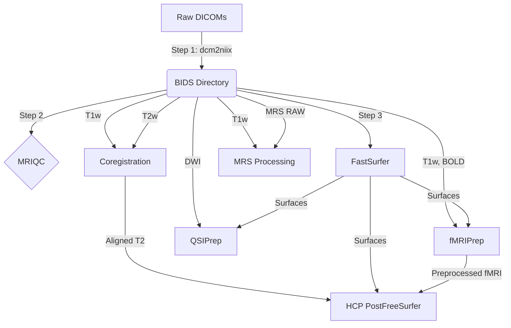

# Mindquad: Multimodal Neuroimaging Pipeline

Mindquad is a comprehensive, scalable Snakemake pipeline designed for preprocessing and analyzing multimodal neuroimaging data, including functional MRI (fMRI), diffusion MRI (dMRI), structural imaging, and Magnetic Resonance Spectroscopy (MRS).

## 🚀 Workflow Overview

The pipeline strictly follows BIDS standards and integrates several state-of-the-art neuroimaging tools. 



### Processing Steps:
1. **BIDS Setup**: Converts raw DICOMs to NIFTI format using `dcm2niix` and organizes them into a strict BIDS hierarchy.
2. **MRIQC**: Performs automated quality control on T1w, BOLD, and DWI acquisitions.
3. **FastSurfer**: Rapid structural T1w segmentation and surface reconstruction.
4. **fMRIPrep**: Preprocesses functional BOLD data, integrating anatomical surfaces generated by FastSurfer.
5. **QSIPrep**: Preprocesses diffusion MRI (DWI), including MP-PCA denoising and Gibbs unringing, utilizing FastSurfer outputs.
6. **Coregistration**: Performs diffeomorphic transformations to align T2w structural scans to the T1w reference using ANTs/DIPY SyN.
7. **HCP PostFreeSurfer**: Builds an HCP-compatible directory scaffold, symlinks required structural meshes, and executes `PostFreeSurferPipeline.sh`.
8. **MRS Processing**: Performs frequency/phase drift correction, tissue segmentation (using T1w scans), and spectral fitting using `fsl_mrs`.

---

## 🛠️ Environment Setup & Installation

This pipeline relies on a mix of High-Performance Computing (HPC) modules and localized Python packages.

### 1. HPC Modules
The following tools must be available via your HPC's module system. If running locally, you must have these binaries in your PATH:
- `dcm2niix`
- `fastsurfer`
- `fmriprep`
- `hcppipelines`
- `fsl_mrs` (Requires FSL to be loaded in the environment)

*Example:*
```bash
module load dcm2niix fastsurfer fmriprep hcppipelines
```

### 2. Python Environment
Tools like `mriqc`, `qsiprep`, and Snakemake itself must be installed into a local Python virtual environment.

```bash
# Create a virtual environment using Python 3.11+
python3 -m venv .venv
source .venv/bin/activate

# Install requirements
pip install -e .
```

---

## ⚙️ Customizing for Other Datasets

This pipeline is highly adaptable and can be pointed to completely different raw datasets by modifying the `mindquad/config/config.yaml` file.

### 1. Pointing to New Data
Change the `raw_data_dir` to point to your new DICOM/raw data folder:
```yaml
raw_data_dir: "/path/to/your/new/dataset"
```

### 2. Subject Discovery
By default, the pipeline will **auto-discover** any subject folders located inside `raw_data_dir` that do not start with a dot (`.`).
If you want to run a specific subset of subjects, explicitly list them in the config:
```yaml
subjects:
  - "subject_01"
  - "subject_02"
```

### 3. Scaling CPU Cores
Previous strict CPU limits have been removed! You can now scale up the pipeline to use the full power of your machine. Update the global or tool-specific `threads` limit in `mindquad/config/config.yaml`:
```yaml
threads: 16
```
*(Make sure to match this with the `--cores` flag when executing Snakemake!)*

### 4. External Configuration Files
You do not need to keep your configuration file inside the repository. You can maintain your own `.yaml` config file anywhere on your system and pass it to Snakemake at runtime using the `--configfile` argument. This is especially useful for managing different environments or datasets without modifying the repository.
```bash
snakemake -s mindquad/workflow/Snakefile --cores 16 --configfile /path/to/my_custom_dataset.yaml
```
*Note: This will override any settings present in the default `mindquad/config/config.yaml`. If you use an external config, you can safely delete `mindquad/config/config.yaml` from the repository.*

---

## 📄 Configuration Reference

A template configuration file (`config_template.yaml`) is provided in the root of the repository. Below is a breakdown of all possible configuration options:

### General & Paths
| Option | Type | Mandatory? | Description |
|---|---|---|---|
| `raw_data_dir` | String | **Yes** | Absolute path to the raw DICOM dataset directory. |
| `bids_dir` | String | No | Output folder for BIDS-converted data (Default: `bids`). |
| `derivatives_dir`| String | No | Output folder for all pipeline derivatives (Default: `derivatives`). |
| `work_dir` | String | No | Intermediate working directory for tools like QSIPrep (Default: `work`). |
| `tmp_dir` | String | No | Temporary directory for pipeline scratch data (Default: `.tmp`). |
| `threads` | Integer | No | Global fallback limit for CPU cores across all rules (Default: `2`). |
| `subjects` | List | No | Explicit list of subject folder names to process. If empty, auto-discovers all non-hidden folders in `raw_data_dir`. |
| `subject_mapping`| Dict | No | Maps raw subject folder names to desired BIDS participant labels (without `sub-`). |

### Tool-Specific Blocks
Each tool has its own configuration block (e.g., `mriqc:`, `fastsurfer:`). Common options across tools include:
- `threads`: (Integer) Override the global core limit for this specific tool.
- `args`: (String) Extra CLI arguments appended directly to the tool's execution command.
- `module`: (String) Name of the HPC module to load (if applicable).
- `fs_license`: (String) Path to your FreeSurfer `license.txt` (Required for FastSurfer, fMRIPrep, QSIPrep).

**Specific highlights:**
- **MRIQC**: `modalities` (List) - Which modalities to run (T1w, bold, dwi). `mem_gb` (Int).
- **fMRIPrep**: `output_spaces` (List) - e.g., `MNI152NLin2009cAsym:res-2`. `cifti_output` (String) - e.g., `91k`.
- **QSIPrep**: `denoise_method` (String), `unringing_method` (String), `output_resolution` (Float).
- **Coregistration**: `tool` (String - e.g., `dipy`, `ants`), `metric` (String - e.g., `CC`), `transform_type` (String - e.g., `syn`).
- **HCP**: `hires_mesh` (Int), `low_res_mesh` (Int), `reg_name` (String - e.g., `MSMSulc`).
- **MRS**: `fit_algorithm` (String - e.g., `Newton`), `ppm_range` (List of Floats), `baseline_order` (Int).

---

## 💻 Execution Instructions

Ensure you have activated your virtual environment before running Snakemake.

```bash
source .venv/bin/activate
```

### Running Locally
To test the pipeline locally, you can run Snakemake directly. 

```bash
# Dry-run to preview the execution plan
snakemake -s mindquad/workflow/Snakefile -n

# Execute the pipeline using 2 cores
snakemake -s mindquad/workflow/Snakefile --cores 2
```

### Running on an HPC Cluster (SLURM)
To run the full pipeline on a cluster, you must submit it via a Snakemake profile. Do **not** use `--cores` higher than 2 if running on a login node. Instead, let Snakemake submit individual jobs:

```bash
snakemake -s mindquad/workflow/Snakefile --profile slurm
```
*(Ensure you have a `.config/snakemake/slurm` profile configured for your specific HPC environment).*
